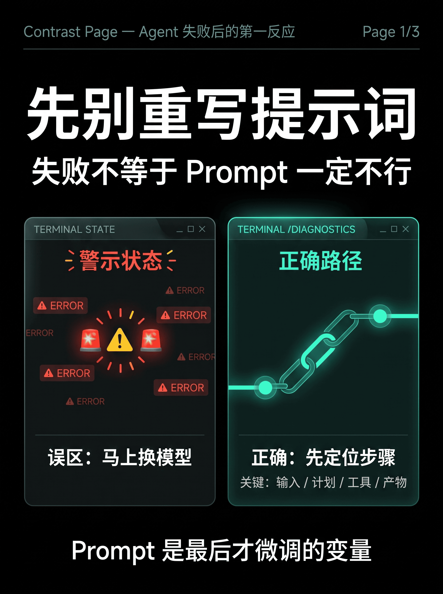
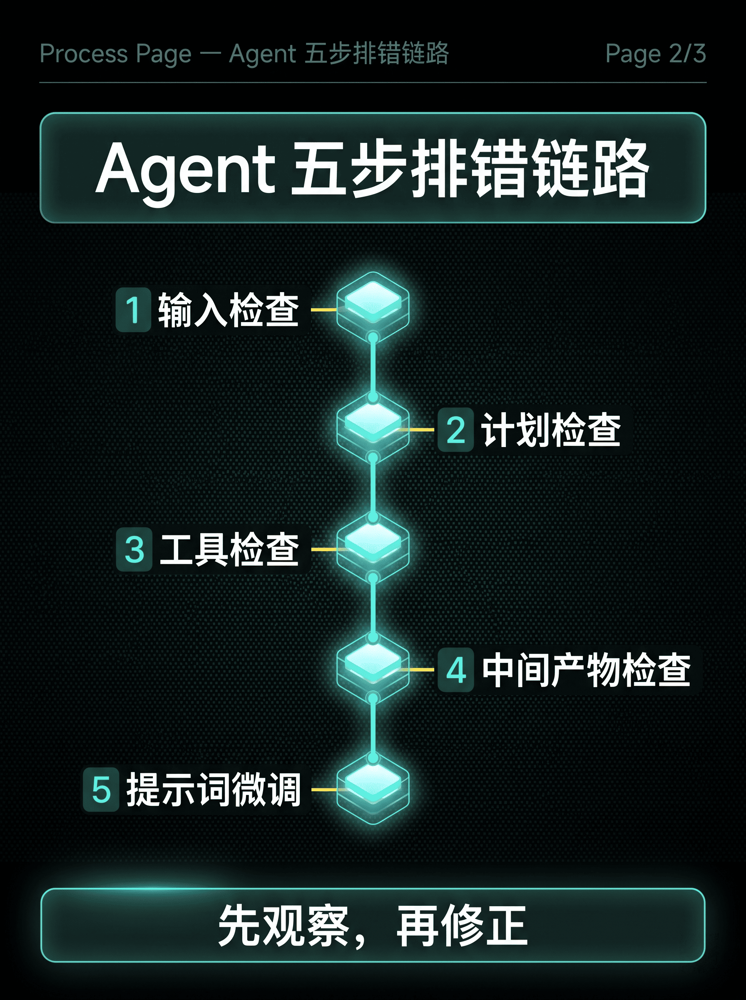
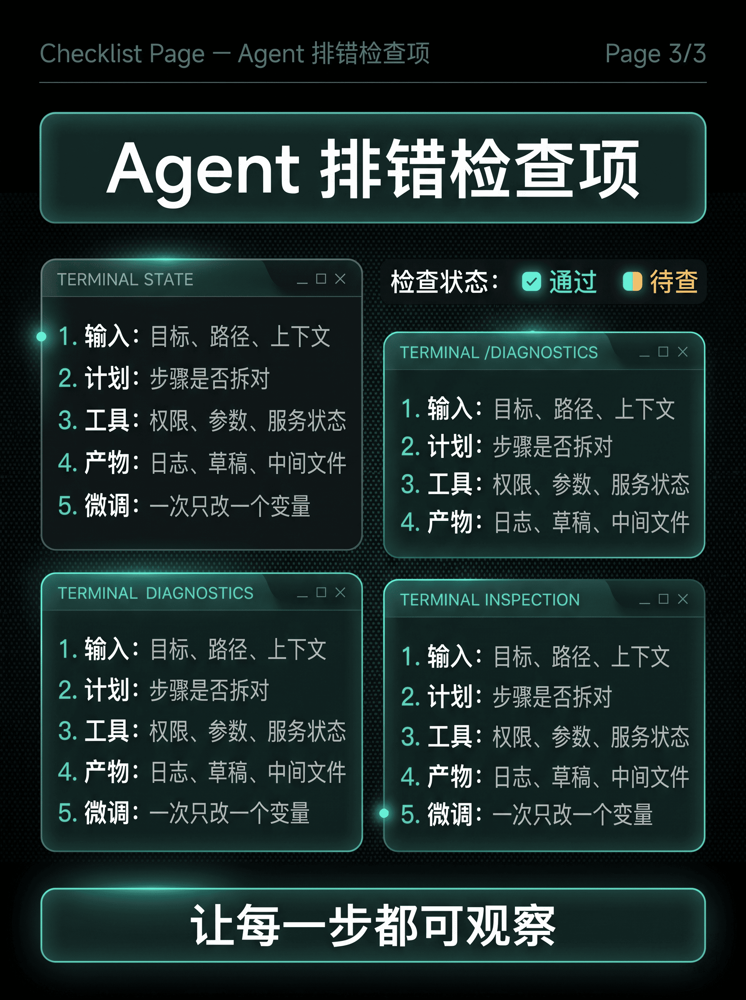

# MoreImg

English documentation: `README_EN.md`.

MoreImg 是一个 Codex Skill，用于把用户已经沟通确认的话题、中文文章草稿、小红书笔记文案或分页卡片文案，整理成带设计风格的小红书图文卡文生图提示词包。

它的目标不是重新发明选题，也不是生成最终图片，而是把内容优化成可交给生图模型使用的结构。

默认输出：

- `cards.md`：图文卡结构、页型、入图文字、语义映射、避免误读说明和发布配文。
- `prompts.md`：选定风格、Style Lock、提示词骨架和逐页文生图提示词。

固定流程：

```text
topic/article/card copy -> Page Spec -> cards.md + prompts.md
```

MoreImg 在提示词和发布配文生成后停止。它不生成位图图片，不制作 HTML，不组装 PPTX，不生成缩略图板，也不打包 zip 文件。

## 安装

如果你正在 Codex 里安装，可以直接对 Codex 说：

```text
请安装这个 Codex Skill：https://github.com/WoodSlope/moreimg-skill
```

也可以在终端运行官方 skill 安装脚本：

```bash
python ~/.codex/skills/.system/skill-installer/scripts/install-skill-from-github.py \
  --repo WoodSlope/moreimg-skill \
  --path . \
  --name moreimg-skill
```

这个仓库的 `SKILL.md` 位于仓库根目录，所以安装路径是 `.`。安装后重启 Codex，或开启一个新线程，让 Codex 重新加载本地 skills。

如果你的环境没有预装 `skill-installer`，可以手动安装：

```bash
mkdir -p ~/.codex/skills
git clone https://github.com/WoodSlope/moreimg-skill.git ~/.codex/skills/moreimg-skill
```

## 适用场景

适合：

- 把中文文章改成小红书图文卡提示词。
- 把已经分页的小红书卡片文案改成文生图提示词。
- 调用内置风格生成统一视觉风格的 `cards.md` 和 `prompts.md`。
- 保存、更新或复用图文卡视觉风格。
- 对已有 `cards.md` 或 `prompts.md` 做局部返修。

不适合：

- 直接生成最终图片。
- 制作 PPT、HTML、网页或前端应用。
- 只做普通文案润色。

## 内置风格

- `xhs-tech-knowledge`：浅色银灰蓝科技知识卡。
- `xhs-terminal-tech-magazine`：深色终端/HUD 科技杂志卡。
- `xhs-impact-grid-editorial`：机构报告和咨询网格风。
- `xhs-french-editorial-commerce`：法式精品杂志和生活方式电商风。
- `xhs-warm-photo-editorial`：暖调真实摄影杂志风。

## 常用调用

列出可用风格：

```text
用 MoreImg 列出可用风格。
```

按风格 ID 调用：

```text
用 MoreImg 调用 xhs-terminal-tech-magazine，把这篇文章做成小红书图文卡提示词。
```

按中文别名调用：

```text
用法式电商杂志风，把这段文案做成 4 页小红书卡片提示词。
```

默认输出始终是 `cards.md` 加 `prompts.md`。列出风格是主要例外，只输出简洁风格列表。

## 输出示例

每个示例都包含一份输入文章，以及对应生成的 `cards.md` 和 `prompts.md`：

| 场景 | 输入文章 | cards.md | prompts.md |
| --- | --- | --- | --- |
| Workflow / Skill 概念关系 | [workflow-concept.md](test-fixtures/articles/workflow-concept.md) | [cards.md](test-fixtures/expected/workflow-concept/cards.md) | [prompts.md](test-fixtures/expected/workflow-concept/prompts.md) |
| 终端科技杂志风排错笔记 | [agent-debug-terminal.md](test-fixtures/articles/agent-debug-terminal.md) | [cards.md](test-fixtures/expected/agent-debug-terminal/cards.md) | [prompts.md](test-fixtures/expected/agent-debug-terminal/prompts.md) |
| 法式电商杂志风胶囊衣橱 | [capsule-wardrobe-commerce.md](test-fixtures/articles/capsule-wardrobe-commerce.md) | [cards.md](test-fixtures/expected/capsule-wardrobe-commerce/cards.md) | [prompts.md](test-fixtures/expected/capsule-wardrobe-commerce/prompts.md) |

更多完整基线在 `test-fixtures/expected/`。

## 图文卡提示词生成示例

<table>
  <tr>
    <td></td>
    <td></td>
    <td></td>
    <td></td>
  </tr>
</table>

## 目录结构

- `.gitignore`：忽略系统文件、编辑器文件、临时文件、日志和生成产物。
- `SKILL.md`：运行时说明和固定 MoreImg 工作流。
- `README.md`：中文说明，也是 GitHub 默认展示页。
- `README_EN.md`：英文说明。
- `README_CN.md`：中文说明镜像，用于兼容旧链接。
- `CONTRIBUTING.md`：贡献规则，说明如何修改工作流、fixture 和风格文件。
- `RELEASE_CHECKLIST.md`：开源发布前检查清单。
- `RELEASE_NOTES.md`：初始发布说明和验证摘要。
- `references/`：运行时参考文件，以及维护用回归场景。
- `styles/`：可复用视觉风格文件。
- `test-fixtures/`：测试输入和人工预期输出。
- `scripts/check-fixtures.sh`：轻量机械检查脚本。
- `agents/openai.yaml`：可选 OpenAI/Codex agent 元数据；核心 skill 不依赖它。

维护材料不是运行时必读引用。正常使用 MoreImg 时，不应读取 `test-fixtures/`、`expected/` 或 `references/regression-tests.md`。

## 维护与发布

修改运行时行为前，请先阅读 `CONTRIBUTING.md`，并为变更补充回归场景、fixture、expected output 或脚本检查。

发布前运行：

```bash
scripts/check-fixtures.sh
```

发布到公开仓库前，请按 `RELEASE_CHECKLIST.md` 检查文件卫生、许可证、贡献规则、运行边界和来源说明。

## 许可证

MoreImg 使用 MIT License。详见 `LICENSE`。

MoreImg 的预生成工作流受到 `visual-style-ppt-skill` 的启发，但只复用了适合图文卡提示词生成的前置能力，例如风格文件、Style Lock、页型选择、结构化提示词、风格保存和质量检查。MoreImg 不复制它的 Image2 生成路线、缩略图确认、图片审查、PPTX 组装或 zip 打包流程。
